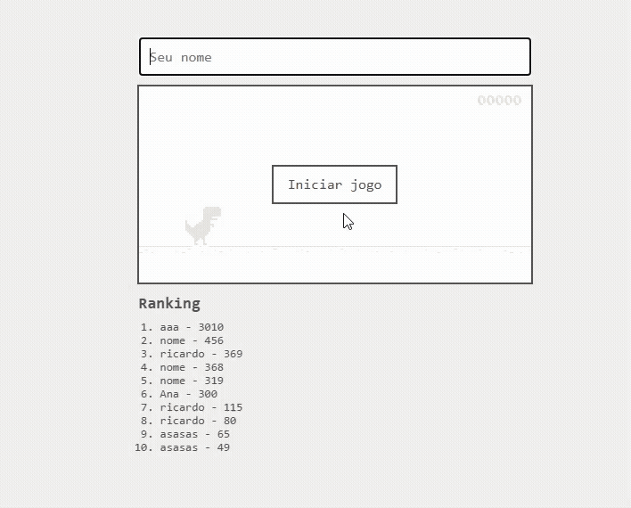

# Projeto: Aplicação com persistência de dados em backend

## Acesso
https://rpfacco-dino-game.netlify.app

## Desenvolvedor(a)
Nome: Ricardo Facco Pigatto  
Curso: Sistemas de Informação

## Proposta
- Desenvolver um jogo estilo “Dino Game” (aquele joguinho do dinossauro que aparece no navegador sem internet)
- O jogo consiste de um personagem parado no canto esquerdo da tela, enquanto desvia de obstáculos (pulando) para sobreviver o maior tempo possível.
- É necessário persistência de dados, com uma tela de ranking mostrando os jogadores com maior score. Quanto mais o jogador sobrevive no jogo, maior o score.
- Não é preciso autenticação/login, porém é necessário um campo para que o usuário informe o ‘nome’ para ser colocado no ranking.
- O jogo é desenvolvido seguindo o conceito “mobile-first”, ou seja, prioriza a experiência em dispositivos móveis.

## Desenvolvimento

### Processo

Substitua este texto por uma descrição do processo de desenvolvimento **em primeira pessoa, sem ajuda de IA**, explicando e justificando suas escolhas, destacando o que já sabia ou não, como lidou com dúvidas ou dificuldades específicas, que adaptações foram necessárias, etc. Evite comentários genéricos como "pedi ajuda para IA e resolvi", dando preferência para expor detalhes específicos de um problema e sua solução.

### Trechos de código

Indique pelo menos 3 trechos de código que você queira destacar para a turma (por exemplo, para explicar algo que aprendeu, para alertar sobre alguma dificuldade de compreensão, para mostrar uma curiosidade, etc).

## Tecnologias

### Linguagens e afins

- Kaplay - **Frontend**
- Python com Flask - **Backend**
- Supabase - **Banco de dados**
- Render e Netifly - **Hospedagem back e front**

### Ambiente de desenvolvimento

- IntelliJ IDEA
- Git e GitHub

## Referências e créditos

- https://youtu.be/9NdeMbMzC2A?si=m6GPu-o06-u_NMDr - Kaplay + Flappy Bird by Justin Lee
- https://youtu.be/2GGwz8zUy2M?si=3IqnNBmHpSXSxA4G - Flask setup tutorial by Noah Does Coding

---
Projeto entregue para a disciplina de [Desenvolvimento de Software para a Web](http://github.com/andreainfufsm/elc1090-2026b) em 2026b
